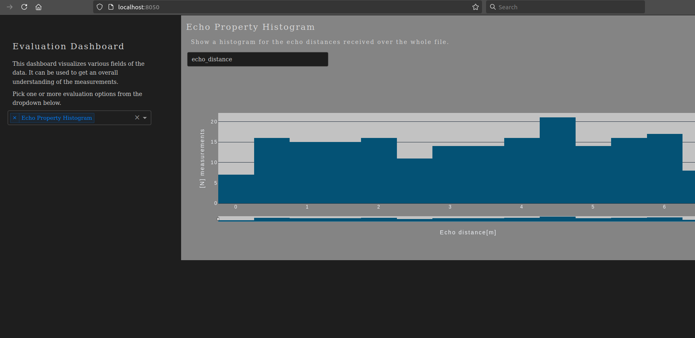

# Evaluation Dashboard

This package is used as an `uv` test. The original use was to provide evaluation plots using `dash`.
The plots itself are now not off highest importance but might serve as reference for future use-cases.
The main goal of this repo is to showcase and practice the use of `uv` as package manager.


Example screenshot from a plot in the running dashboard.


## How to use
### Environment
First create your `venv` (for this example with `uv`):


```bash
uv venv
```

https://docs.astral.sh/uv/reference/cli/#uv-venv for more details, or simply via `--help`.

```bash
source .venv/bin/activate
uv run evaluation_dashboard.py \
--input_file ./data/dummy.json \
--data_adapter DummyJsonDataAdapter \
--port 8050
```

`port` is optional, default is 8050, for `data_adapter` all possible choices are listed when running the script
with `--help`. `input_file` in this minimal working example only works for the file `./data/dummy.json` which 
contains random data points, but with the expected shape(s) and value ranges for `DummyJsonDataAdapter`.
Right now there is only one adapter and one example/dummy data file. Iff this code would be used for some real-world
analysis, one would likely write new adapters. With that one could invoke the wrong combination of input data and data 
adapters. The responsibility to make sure that the passed script arguments do in fact match, is delegated to the
user of the script.

When new python modules are needed, add them and then sync the environment:

```bash
 uv add <module_name>
 uv sync
 ```

https://docs.astral.sh/uv/reference/cli/#uv-sync (the sync is not yet tested, but as from the docs 
seems the right way to do).

### Jupyter Notebook
For a truly interactive evaluation session we recommend to use the notebook in the `./notebooks` folder:

```bash
jupyter notebook --port <port> --notebook-dir ./notebooks
```

And then select the `evaluation_notebook.ipynb`. 
From there on, run each of the predefined cells as needed or run your own code directly.

When making a change in the jupyter notebook make sure to clear all outputs before commiting.
This will make sure to keep the file size relatively small.
This can be done from the notebook itself via `Cell -> All Output -> Clear`. 

## How to extend
If there is a plot for your evaluation missing, it is easy to add a new evaluation simply by:
1) Creating an appropriate file in folder `evaluation_semantics` for it.
2) Create a class that inherits from `EvaluationSemanticBase` and implement its abstract methods.
3) Add the usage to the notebook manually. 

Note that for the dashboard to "load" a new evaluation class no new code has to be written.
Simply re-start the running dashboard (classes will be allocated once at start of the script
and dynamically imported for usage). 

If you want to read data that has not been used before you need to implement a respective data adapter:
1) Create an appropriate file in folder `data_adapter` for it.
2) Create a class that inherits from `DataAdapter` and implement its abstract methods.
3) Make sure that you pass the right data adapter (name) alongside your input file when running the dashboard script.
